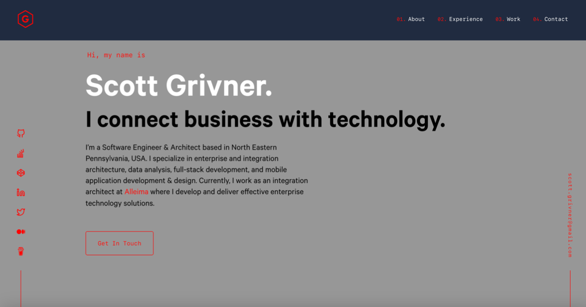

<!-- Begin README -->

<div align="center">
    <a href="https://scottgrivner.dev" target="_blank">
        
    </a>
</div>
<br>
<p align="center">
    <a href="https://www.gatsbyjs.com/"></a>
    <a href="https://react.dev/"></a>
    <a href="https://www.netlify.com/"></a>
    <br>
    <a href="https://github.com/scottgriv"></a>
    <a href="mailto:scott.grivner@gmail.com"></a>
    <a href="https://www.buymeacoffee.com/scottgriv"></a>
    <br>
    <a href="https://prgportfolio.com"></a>
</p>

---

<h1 align="center">💼 Portfolio Website 💼</h1>
<p align="center">
    <a href="https://app.netlify.com/sites/scottgrivner/deploys" target="_blank">
    
    </a>
</p>
<p align="center">
  The first iteration of <a href="https://scottgrivner.dev" target="_blank">scottgrivner.dev</a> built with <a href="https://www.gatsbyjs.org/" target="_blank">Gatsby</a> and hosted with <a href="https://www.netlify.com/" target="_blank">Netlify</a>
</p>



---

## Table of Contents

- [Features](#features)
- [Getting Started](#getting-started)
  - [Installation & Set Up](#installation--set-up)
  - [Building and Running for Production](#building-and-running-for-production)
  - [Color Reference](#color-reference)
- [Resources](#resources)
- [License](#license)
- [Credits](#credits)

## Features

- 📱 **PWA** - Fully functional as a Progressive Web App.
- 📱 **Responsive Design** - Optimized for mobile devices.
- 📊 **SEO Friendly** - Built with SEO in mind following the latest industry standards.
- 🤖 **Schema Markup** - Structured data is implemented to help search engines understand the content on the site.
- 📄 **CV** - A downloadable resume in PDF format.
- 📧 **Contact Form** - A working contact form powered by Formspree.
- 🚀 **Performance** - Optimized for lightning-fast loading speeds.
- 🎨 **SVG Icons** - Custom SVG icons created with Figma.
- 🎨 **Color Theme** - Easily change the website color theme by updating the color variables in the `variables.js` file.

## Getting Started

### Installation & Set Up

1. Install the Gatsby CLI

   ```sh
   npm install -g gatsby-cli
   ```

2. Install and use the correct version of Node using [NVM](https://github.com/nvm-sh/nvm)

   ```sh
   nvm install
   ```

3. Install dependencies

   ```sh
   yarn install
   ```

4. Start the development server

   ```sh
   npm start
   ```

### Building and Running for Production

1. Generate a full static production build

   ```sh
   npm run build
   ```

1. Preview the site as it will appear once deployed

   ```sh
   npm run serve
   ```

### Color Reference

| Color         | Hex                                                          |
| ------------- | ------------------------------------------------------------ |
| Dark Navy     |  `#020c1b` |
| Light Navy    |  `#112240` |
| Lightest Navy |  `#233554` |
| Dark Slate    |  `#495670` |
| Gray          |  `#979797` |
| Red           |  `#E00000` |
| Blue          |  `#57cbff` |
| Black         |  `#000000` |
| White         |  `#ffffff` |

## Resources

- [Gatsby](https://www.gatsbyjs.com/)
- [Netlify](https://www.netlify.com/)
- [React](https://reactjs.org/)

## License

This project is released under the terms of the **MIT License**, which permits use, modification, and distribution of the code, subject to the conditions outlined in the license.

- The [MIT License](https://choosealicense.com/licenses/mit/) provides certain freedoms while preserving rights of attribution to the original creators.
- For more details and to understand all requirements and conditions, see the [LICENSE](LICENSE) file in this repository.

## Credits

This repo was originally forked from:
[Brittany Chiang's v4 repo](https://github.com/bchiang7/v4).

Website design credit goes to Brittany, I modified the website to fit my needs (explained below):

- Changed the color/theme using the `CSS` color reference on the bottom of this page in the `variables.js` file:
- Created custom SVG logo/icons.
- Updated the About, Experience, Work, and Contact areas to fit my personal needs.
- Added a GitHub link to this repo in the website footer.
- Removed the hover overlay on the project and about photos.
- Updated a number of images/icons/links.
- Added my Stack Overflow link to the left nav bar area.
- Many other small/cosmetic changes.

Feel free to fork this repo but please give me proper credit by linking back to [scottgrivner.dev](https://scottgrivner.dev) as well as the original author, Brittany Chiang's website [brittanychiang.com](https://brittanychiang.com), on your own site or in your `README`. Thanks!

---

<div align="center">
    <a href="https://github.com/scottgriv" target="_blank">
        
    </a>
</div>

<!-- End README -->
