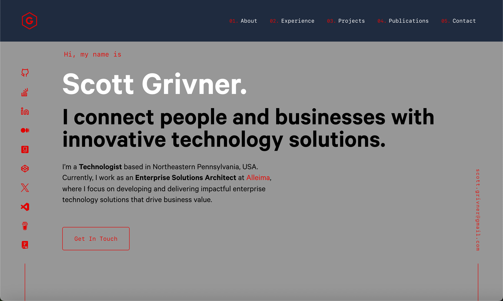

<div align="center">
      <a href="https://scottgrivner.dev" target="_blank">
         
    </a>
</div>
<h1 align="center">
  scottgrivner.dev
</h1>
<p align="center">
  The first iteration of <a href="https://scottgrivner.dev" target="_blank">scottgrivner.dev</a> built with <a href="https://www.gatsbyjs.org/" target="_blank">Gatsby</a> and hosted with <a href="https://www.netlify.com/" target="_blank">Netlify</a>
</p>
<p align="center">
    <a href="https://app.netlify.com/sites/scottgrivner/deploys" target="_blank">
    
    </a>
</p>



## 🚨 Forking this repo (please read!)

This repo was originally forked from
[Brittany Chiang's v4 repo](https://github.com/bchiang7/v4).

Website design credit goes to Brittany, I modified the website to fit my needs (explained below):

- Changed the color/theme using the `CSS` color reference on the bottom of this page in the `variables.js` file:
- Created custom SVG logo/icons.
- Updated the About, Experience, Work, and Contact areas to fit my personal needs.
- Added a GitHub link to this repo in the website footer.
- Removed the hover overlay on the project and about photos.
- Updated a number of images/icons/links.
- Added my Stack Overflow link to the left nav bar area.
- Many other small/cosmetic changes.

Feel free to fork this repo but please give me proper credit by linking back to [scottgrivner.dev](https://scottgrivner.dev) as well as the original author, Brittany Chiang's website [brittanychiang.com](https://brittanychiang.com), on your own site or in your README. Thanks!

## 🛠 Installation & Set Up

1. Install the Gatsby CLI

   ```sh
   npm install -g gatsby-cli
   ```

2. Install and use the correct version of Node using [NVM](https://github.com/nvm-sh/nvm)

   ```sh
   nvm install
   ```

3. Install dependencies

   ```sh
   yarn install
   ```

4. Start the development server

   ```sh
   npm start
   ```

## 🚀 Building and Running for Production

1. Generate a full static production build

   ```sh
   npm run build
   ```

1. Preview the site as it will appear once deployed

   ```sh
   npm run serve
   ```

## 🎨 Color Reference

| Color         | Hex                                                                |
| ------------- | ------------------------------------------------------------------ |
| Dark Navy     |  `#020c1b` |
| Light Navy    |  `#112240` |
| Lightest Navy |  `#233554` |
| Dark Slate    |  `#495670` |
| Gray          |  `#979797` |
| Red           |  `#ff0000` |
| Blue          |  `#57cbff` |
| Black         |  `#000000` |
| White         |  `#ffffff` |
